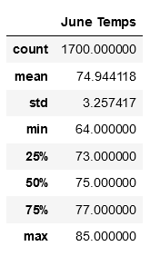
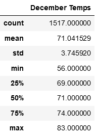

# Surfs Up!
## Overview of Project
After a successful vacation in Hawaii, we have decided to open a combo surf and ice cream shop on Oahu in hopes of living there perminately! Before we make the leap, we want to take a look at weather data for the island to ensure a successful venture.

## Results
To get a decent look into Oahu's annual weather, we were able to perform analysis from a Sqlite database and extract the summary statistics for two crucial months; June and December.
* Based on the fairly constant temperature stats for the month of June, we can conclude that our shop would not be out of place. As seen below, the average temperature is nice and warm without going too far in either direction for the min and max.

* Similarly, for the month of December, we can see that the average temperature does not fall more than 5%. The one notable difference is that the minimum temperatures can drop significantly, with the maximums staying consistant. 

## Conclusion
Based on our analysis of temperature data from Oahu, we can conclude that the weather stays more-or-less consistant year-round, leading us to believe that opening a surf and ice cream shop on the island would be a worthwhile endever! 